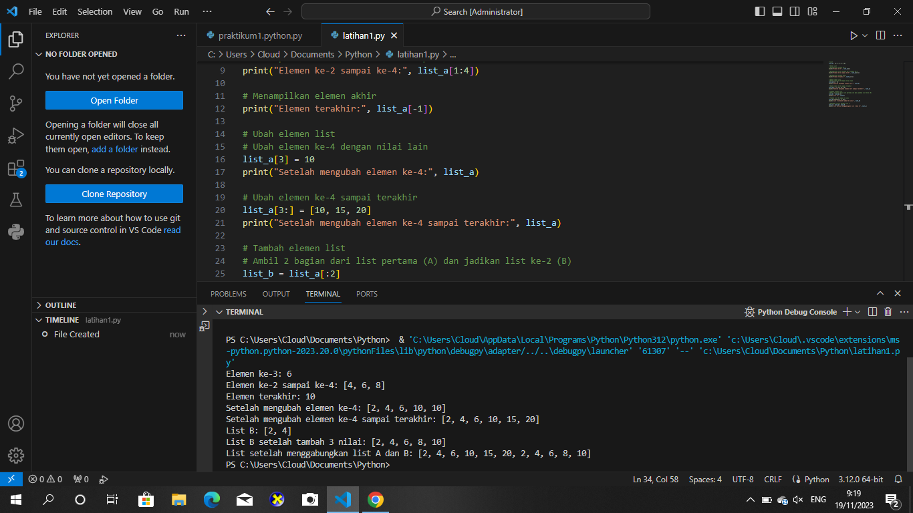

# LANGKAH - LANGKAH

1. Buatlah list yang berisi Nama, NIM, Nilai tugas, Nilai UTS, dan Nilai UAS

2. Lalu input Nama, NIM, Nilai tugas, Nilai UTS, Nilai UAS

3. Jika ingin menambahkan list data ketik 'ya' dan jika tidak ingin menambahkan data ketik 'tidak'. Jawab input(("Tambah data y/t")).

4. Gunakan perintah append pada Nama, NIM, Nilai tugas, Nilai UTS, dan Nilai UAS untuk menambahkan 1 item ke elemen terakhir. Lalu mencari nilai akhir dengan menghitung nilai tugas 30%, UTS 35%, dan UAS 35%, dengan perintah float.

5. Gunakan perulangan for, dengan perintah for i in range(len(Nama)):. Fungsi 'len' untuk mengembalikan panjang (jumlah anggota) dari suatu objek.

6. Lalu cetak dengan perintah print(i+1,Nama[i],NIM[i],TGS[i],UTS[i],UAS[i],Nilaiakhir[i])

7. Selesai.

# LATIHAN

# HASIL LATIHAN 

# TUGAS PRAKTIKUM

# HASIL TUGAS PRAKTIKUM

# FLOWCHART

   
